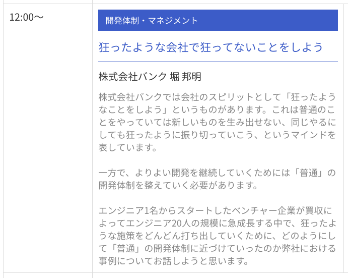

# 表参道.rb #41\\n〜技術的負債〜
subtitle
: 2018-12-06

subtitle
: 表参道.rb #41

author
: うなすけ

theme
: unasuke-white

# 自己紹介
- 名前 : うなすけ
- 所属 : 株式会社バンク (エンジニア)
  - インフラ寄りサーバーサイドエンジニア
  - 業界4年目

- {::tag name="x-small"}GitHub [@unasuke](https://github.com/unasuke){:/tag}
- {::tag name="x-small"}Mastodon [@unasuke@mstdn.unasuke.com](https://mstdn.unasuke.com/@unasuke){:/tag}
- {::tag name="x-small"}Twitter [@yu\_suke1994](https://twitter.com/yu_suke1994){:/tag}

{:relative_width="24" align="right" relative_margin_right="-10" relative_margin_top="42"}

# Rails Developers Meetup 2018 Day 4
{:relative_height="90"}

{::tag name="x-small"}[Rails Developers Meetup 2018 Day 4 Nouvelle Vague｜IT勉強会ならTECH PLAY［テックプレイ］](https://techplay.jp/event/702297){:/tag}

# 技術的負債
{:relative_width="60"}
